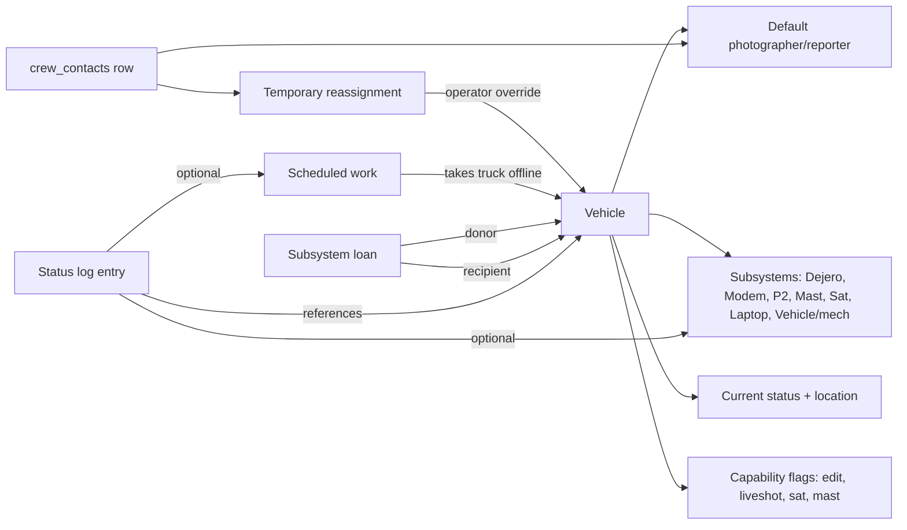

# trackIT v2 — Fleet Manager Roadmap

**Version:** 0.1.0 (proposal) · **Last reviewed:** 2026-05-10

A new top-level **Fleet** module for tracking and managing news vehicles (M1–M25 plus Sat Truck, Expedition, M-26, M-33 maint/eng), their crew assignments, equipment subsystems, scheduled work, and a daily status update log — modeled on the David Fortin update emails. Org-scoped (shared across team workspaces) using the existing `organization_app_data` pattern, with a dedicated table for the append-only status log.

This document has two halves: **ideation** to lock the concept, then a **concrete phased build plan** grounded in this codebase's existing patterns.

---

## Part A — Ideation

### What the email examples tell us we need to model

Every meaningful sentence in a daily fleet update breaks into one of these patterns:

| Example | Modeled as |
|---|---|
| "M20 — Scott Arthur has moved to M20 in San Jose." | crew reassignment + location change |
| "M18 Tahoe — at Smog Shop and will get same repair M17 did last week. I expect it to be out all week." | vehicle status (in shop) + ETA + cross-vehicle reference |
| "M25 — Dejero is on its way for repair. Brian Yuen has M14 Dejero until it is returned." | subsystem failure + cross-truck loaner |
| "M4 — Laptop is having issues; Dean will drive in this morning at 9:30 for IT to assess." | subsystem incident + scheduled drop-in |
| "Sat Truck — air pressure system issue resolved." | subsystem resolution |
| "M16 — Needs oil change, Geoff please route photog to Smog Shop at some point" | preventive task with assignment-desk action item |
| "M3 work is scheduled for 10/6/25 at 11am. Alex can use a spare truck." | scheduled downtime + spare needed |
| "M14 ... blown head gasket ... stable and drivable now." | known degraded condition / limited-use flag |
| "Spare vehicles: M15 (no edit, liveshot only), M20 (Ted Case is not working through the end of the month)" | spare pool with capability caveats |

The attached image is a printed phone roster: a 2-column grid of cards (photographer + M-number, Wk Cell, Truck cell, alt phone). That is a deliverable artifact for the assignment desk, not a UI — but the same data structure feeds a print/PDF view.

### Core entities (concept-level)



### Feature surface

1. **Fleet board (home).** Grid/cards of every vehicle with at-a-glance: M-#, status pill (in-service / spare / in-shop / out-of-service / limited-use), current operator, current location, open issues count, ETA back. Sticky filter chips (in-shop, spares only, has-open-issues).
2. **Vehicle detail drawer.** Tabs:
   - **Overview** — status, location, default photographer/reporter, vehicle type, capabilities, plate/VIN/make/model, parking spot, truck cell #, notes.
   - **Subsystems** — Dejero, Modem, P2 reader, Microwave antenna pan/tilt, Mast air compressor, Satellite/Dish, Air pressure, Laptop/Edit, Camera, Audio, Vehicle/mechanical. Each with status (operational / degraded / down / loaned-out / loaned-in), last-checked, notes, optional `inventoryItemId` link.
   - **Assignments** — default crew, plus list of temporary overrides with date ranges (e.g. "Brian using M14 Dejero 9/15 → until M25 Dejero returns").
   - **Scheduled work** — upcoming + past, with vendor (Smog Shop / Serramonte Ford / IT / Joe truck tech / Dejero RMA), task, scheduled date, expected return, status.
   - **Log** — per-vehicle reverse-chrono feed of status entries.
3. **Daily status log (fleet-wide).** Append-only timeline. Each entry has: timestamp, author, vehicle(s), category (issue / scheduled / resolved / reassignment / location / info), free text, optional photo. Filter by vehicle, date range, category.
4. **Daily digest composer.** Select today's entries → renders a Fortin-style email body grouped by vehicle. Copy-to-clipboard + `mailto:` button. Save composed digests as historical records.
5. **Spare pool board.** Prominent panel listing in-service-but-spare vehicles, with capability caveats ("M15: no edit, liveshot only"). Quick-claim assigns a spare to a photographer for a date range, which shows up as a temporary assignment.
6. **Subsystem swap workflow.** "Move Dejero from M14 to M25" creates a paired loan record (donor + recipient + expected return), updates both subsystem statuses, and writes a log entry automatically. When closed, both flip back.
7. **Phone roster (printable).** 2-column card grid mirroring the attached image: photographer name + M-#, Wk Cell, Truck cell, alt phones. Print stylesheet matching the existing wall-sheet format. Bonus: vCard / CSV export.
8. **Dashboard widget.** "Fleet today" card on `DashboardPage`: trucks-in-shop count, spares-available count, scheduled returns this week.
9. **Cross-module integrations** (later phases):
   - Productions `VehiclePacklist` items can link to a fleet vehicle id; the packlist warns "M5 currently in shop, ETA Friday."
   - Tracked subsystems can link to existing inventory items so loans become inventory check-out/in events.
   - Crew contacts already exist (`crew_contacts`); fleet uses `contactId` for default photographer/reporter (single source of truth for phone numbers).

### Status taxonomy (locked vocabulary)

- **Vehicle status:** `in_service` | `spare` | `in_shop` | `out_of_service` | `limited_use`
- **Subsystem status:** `operational` | `degraded` | `down` | `loaned_out` | `loaned_in` | `awaiting_repair`
- **Log category:** `issue` | `scheduled` | `resolved` | `reassignment` | `location` | `info`
- **Scheduled work status:** `scheduled` | `in_progress` | `done` | `cancelled`

---

## Part B — Buildable plan

### Architecture decisions

- **Data tier: organization-scoped.** The fleet is the station's, shared across all team workspaces — same model as contacts and position templates.
- **Storage split (matches existing conventions):**
  - Vehicles, subsystems, current assignments, scheduled work → JSONB on `organization_app_data` (small, rewritten as a unit, like `contacts` and `position_templates` in [supabase/migrations/20260510120000_organization_library.sql](../supabase/migrations/20260510120000_organization_library.sql)).
  - Status log → dedicated append-only table `organization_fleet_log` (volume grows fast: ~10 entries/day × 365 = thousands/year; benefits from real timestamps, indexing, multi-author writes, and per-row RLS).
- **Service layer pattern:** mirrors [src/lib/positionTemplatesService.ts](../src/lib/positionTemplatesService.ts) and [src/lib/crewContactsService.ts](../src/lib/crewContactsService.ts) — read from in-memory org snapshot, write back via `pushOrganizationSnapshot`.
- **Top-level route:** `/fleet` (peer of `/productions`, `/inventory`). Add nav item to [src/components/Navigation.tsx](../src/components/Navigation.tsx) using a `Truck` icon from `lucide-react`.

### Type model — `src/types/fleet.ts` (new)

```ts
export type VehicleStatus = 'in_service' | 'spare' | 'in_shop' | 'out_of_service' | 'limited_use';
export type SubsystemStatus = 'operational' | 'degraded' | 'down' | 'loaned_out' | 'loaned_in' | 'awaiting_repair';
export type LogCategory = 'issue' | 'scheduled' | 'resolved' | 'reassignment' | 'location' | 'info';
export type ScheduledWorkStatus = 'scheduled' | 'in_progress' | 'done' | 'cancelled';

export type VehicleKind = 'truck' | 'suv' | 'sat_truck' | 'expedition' | 'maint_eng';
export type CapabilityFlag = 'edit' | 'liveshot' | 'dejero' | 'satellite' | 'microwave_mast' | 'p2' | 'audio_pkg';

export interface VehicleSubsystem {
  id: string;
  kind: 'dejero' | 'modem' | 'p2_reader' | 'microwave_mast' | 'sat_dish' | 'air_pressure'
        | 'laptop' | 'camera' | 'audio' | 'vehicle_mech' | 'other';
  label: string;
  status: SubsystemStatus;
  notes?: string;
  inventoryItemId?: string;     // optional link to InventoryItem
  lastCheckedAt?: string;
}

export interface VehicleAssignment {
  id: string;
  contactId: string;            // -> crew_contacts row
  role: 'photographer' | 'reporter' | 'operator';
  isDefault: boolean;
  startDate?: string;           // ISO date; undefined = open-ended default
  endDate?: string;
  notes?: string;
}

export interface ScheduledWorkEntry {
  id: string;
  scheduledFor: string;         // ISO date(time)
  vendor?: string;              // free text initially; later a configurable list
  task: string;
  status: ScheduledWorkStatus;
  expectedReturn?: string;
  takesOffline: boolean;        // when true and active, vehicle status becomes in_shop
  notes?: string;
}

export interface SubsystemLoan {
  id: string;
  donorVehicleId: string;
  recipientVehicleId: string;
  subsystemKind: VehicleSubsystem['kind'];
  startedAt: string;
  expectedReturn?: string;
  resolvedAt?: string;
  notes?: string;
}

export interface FleetVehicle {
  id: string;
  code: string;                 // "M5", "Sat Truck", "Expedition"
  kind: VehicleKind;
  displayOrder: number;
  status: VehicleStatus;
  location?: string;            // free text + autocomplete from history
  capabilities: CapabilityFlag[];
  truckCellPhone?: string;      // travels with the vehicle
  plate?: string;
  vin?: string;
  make?: string;
  model?: string;
  year?: number;
  parkingSpot?: string;
  subsystems: VehicleSubsystem[];
  assignments: VehicleAssignment[];
  scheduledWork: ScheduledWorkEntry[];
  notes?: string;
  createdAt: string;
  updatedAt: string;
}

export interface FleetState {
  vehicles: FleetVehicle[];
  loans: SubsystemLoan[];       // active + recent (cap or archive after N days)
}

export interface FleetLogEntry {
  id: string;                   // db-side uuid for the dedicated table
  organizationId: string;
  occurredAt: string;
  authorUserId: string;
  vehicleIds: string[];         // multi-select to support cross-truck entries
  category: LogCategory;
  body: string;
  attachmentUrls?: string[];
  scheduledWorkId?: string;     // optional join back to a ScheduledWorkEntry
}
```

### Data layer changes

- **Migration (new):** `supabase/migrations/<timestamp>_organization_fleet.sql`
  - `ALTER TABLE public.organization_app_data ADD COLUMN IF NOT EXISTS fleet jsonb NOT NULL DEFAULT '{"vehicles":[],"loans":[]}'::jsonb;`
  - `CREATE TABLE public.organization_fleet_log (...)` with `organization_id`, `occurred_at`, `author_user_id`, `vehicle_ids text[]`, `category`, `body`, `scheduled_work_id`, `attachments jsonb`, plus indexes on `(organization_id, occurred_at desc)` and `vehicle_ids` (gin).
  - RLS modeled on the `organization_app_data` policies in [supabase/migrations/20260510120000_organization_library.sql](../supabase/migrations/20260510120000_organization_library.sql): `select` for any org member; `insert`/`update` for `editor` / `admin` / owner.
- **Service (new):** `src/lib/fleetService.ts`
  - `getFleet()`, `saveFleet(state)`, `upsertVehicle()`, `removeVehicle()`, `setVehicleStatus()`, `addAssignment()`, `endAssignment()`, `openLoan()`, `closeLoan()`, `addScheduledWork()`, `updateScheduledWork()`.
  - Reads from in-memory org snapshot + persists via `pushOrganizationSnapshot` from [src/lib/supabase/organizationData.ts](../src/lib/supabase/organizationData.ts) (extend `OrganizationAppDataRow` and `OrganizationSnapshotPayload` with `fleet`).
- **Service (new):** `src/lib/fleetLogService.ts`
  - `listLogEntries({ vehicleId?, since?, until?, category? })`, `appendLogEntry()`, `deleteLogEntry()` against `organization_fleet_log`.

### UI surface

- New page `src/pages/FleetPage.tsx`, routed at `/fleet` in [src/App.tsx](../src/App.tsx) inside `ProtectedRoute`.
- New nav item in [src/components/Navigation.tsx](../src/components/Navigation.tsx) (`Truck` icon).
- Components under `src/components/fleet/`:
  - `FleetBoard.tsx` — grid of `VehicleCard` plus filter chips and a sticky **Spare pool** rail.
  - `VehicleCard.tsx` — compact card (M-#, status pill, current operator, location, open-issues badge).
  - `VehicleDetailSheet.tsx` — right-side `Sheet` with tabs **Overview / Subsystems / Assignments / Scheduled / Log**.
  - `VehicleEditDialog.tsx` — create/edit metadata.
  - `SubsystemRow.tsx`, `AssignmentRow.tsx`, `ScheduledWorkRow.tsx` — inline editors.
  - `SubsystemLoanDialog.tsx` — "Move &lt;subsystem&gt; from &lt;donor&gt; to &lt;recipient&gt;" workflow.
  - `LogEntryDialog.tsx` — compose log entry (vehicles multi-select, category, body, attachments).
  - `LogTimeline.tsx` — reverse-chrono feed (used in detail tab + a fleet-wide tab).
  - `DailyDigestComposer.tsx` — pick date range, group by vehicle, render plain-text body, copy/`mailto:`.
  - `PhoneRoster.tsx` — printable 2-column card grid styled to match the attached image; uses crew contacts + vehicles.
- Add a small **Fleet today** widget on `src/pages/DashboardPage.tsx` (counts: in-shop / spares / scheduled returns this week).

### Phased build (each phase = one PR)

| Phase | Scope |
|---|---|
| **1 — Foundation & board** | Migration adds `fleet` JSONB. Types, `fleetService`, `/fleet` route + nav, `FleetBoard` + `VehicleCard` + `VehicleEditDialog` + `VehicleDetailSheet` (Overview tab only). Seed-helper to scaffold M1–M25 + Sat Truck + Expedition + M-26 + M-33 on first use. |
| **2 — Subsystems & scheduled work** | Subsystems tab + `SubsystemRow` + `SubsystemLoanDialog`. Scheduled tab + `ScheduledWorkRow`. `takesOffline` auto-flips vehicle status to `in_shop` while the entry is active. |
| **3 — Status log table & timeline** | Migration adds `organization_fleet_log` + RLS. `fleetLogService`, `LogEntryDialog`, `LogTimeline` in detail sheet + a fleet-wide `/fleet?tab=log` view. Auto-entries from subsystem loans, scheduled-work transitions, status changes. |
| **4 — Crew assignments & spare board** | Default + temporary assignments via `crew_contacts` picker (reuse existing service). Sticky **Spare pool** rail with quick-claim. Capability-flag caveats surfaced in the rail. |
| **5 — Daily digest composer + phone roster** | `DailyDigestComposer` (selectable entries → grouped plaintext + copy / `mailto:`). `PhoneRoster` printable view. Optional CSV / vCard export. |
| **6 — Cross-module wiring** *(stretch)* | `VehiclePacklist` links to fleet vehicle id; warning chip when `in_shop`. Subsystem `inventoryItemId` linkage to existing inventory and check-in/out. Dashboard **Fleet today** card. |

### Open assumptions (confirm before starting Phase 1)

- "Vehicles" is one shared org library, not per-workspace. Matches contacts / position-templates precedent.
- Single news station per organization (no sub-fleets). If multiple bureaus are needed later, add a `bureau` field on `FleetVehicle` (already supported via `location` + a future filter).
- Status log is only an append-only history; we will not parse inbound emails in v1 (could be added as a later "paste an update" parser).
- Default crew uses existing `crew_contacts`; no fleet-specific contact table.
- Phone roster mirrors the attached image format — print stylesheet, no editable layout in v1.

---

## Related documents

- [README.md](./README.md) — index of trackIT documentation
- [project-structure.md](./project-structure.md) — directory layout, routes, components, services, data model, Supabase schema
- [roadmap.md](./roadmap.md) — main trackIT roadmap (this Fleet doc is a feature-specific spinoff)
- [planner-workspace-and-branding.md](./planner-workspace-and-branding.md) — Productions/Planner module patterns referenced by Phase 6 cross-module wiring
