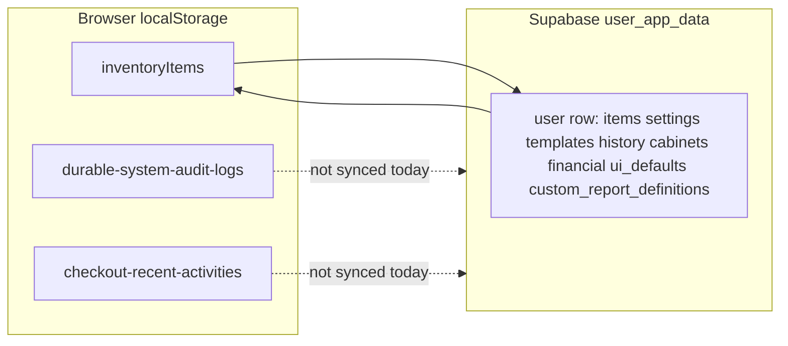

---

name: trackIT production roadmap
source: Versioned in-repo production plan (synced from Cursor plan *trackIT production roadmap*).
last_reviewed: 2026-05-05
overview: >-
  Mixes confirmed root causes in the codebase (dummy rows, local-only logging, UI contrast, scanner fragility,
  per-user Supabase payload) with larger product work (shared inventory, cable lots, device library, mobile).
  Backup strategy favors restore points (rollback) over mandatory daily file saves. Prioritizes verified fixes
  and data model answers, then phases the rest.
todos:

- id: p0-dummy-seed
content: Remove or env-gate DUMMY_INVENTORY_DATA auto-load in useInventory; add optional explicit demo seed; document clearing user_app_data.items for bad rows
status: completed
- id: p0-checkout-contrast
content: Fix CheckoutPage Check In/Out button text colors for light+dark themes
status: completed
- id: p0-scanner-dialog
content: Harden BarcodeScannerDialog (mount/cleanup, errors, mobile) used by AddItemForm
status: completed
- id: p0-bulk-print-delete
content: Tune bulk label CSS; improve batch delete error surfacing (quota / JSON) if reproducible
status: completed
- id: p1-cloud-audit
content: "Design: extend cloud snapshot or new audit table + RLS; persist checkout activity if cross-device required"
status: completed
- id: p1-reports-ux-sync
content: Make custom report save discoverable; optionally sync CUSTOM_REPORTS_KEY via user_app_data
status: completed
- id: p1-backup-restore
content: "MVP: local IndexedDB named restore points (ring buffer, list, confirm restore) + System Logs on create/delete/restore. Deferred: Supabase snapshot store, FS Access / unattended export wizard."
status: completed
- id: p1-settings-backup-tab-ux
content: "Settings Backup & Restore tab: shorten redundant Settings snapshot copy; clarify Create Backup vs Restore vs settings-only vs Import/Export (clearer layout). Lookup Lists: default open to Categories (first list) not empty overview"
status: completed
- id: p2-inventory-domain
content: "Phase 1 done: cableColor, fiberMode (SM/MM/N/A), connectorType, cableLotNumber on InventoryItem + Add/Edit Additional Info + reports column options + inventory search. Nested project selection in Add/Edit/Template forms now supports parent/child path ids. Supplier read-only panel shipped in ItemDetails. Device library: Settings tab + backup/restore + Additional Info combobox (add/edit/template) applies manufacturer, model, website, supplier when name matches list. Deferred: spool/lot usage entity, project hierarchy features beyond selection, optional deviceLibraryId on items."
status: pending
- id: p3-org-rbac-auth
content: "Shipped MVP: workspace_app_data + members + RLS (migration); client switch/create in Settings→Data; bootstrap/push routes; admin-only bulk delete + viewer batch-edit lock; magic link (signInWithOtp); deviceLibraryId on items; dashboard/checkout responsive. Deferred: service-role admin API, full MFA enroll UI, invite-by-email."
status: completed

---

# trackIT: production issues, answers, and phased work

Paths below are **repository-relative** (this workspace).

## What the codebase already shows

### 201 “test” rows after setting categories

- `[src/lib/dummyData.ts](../src/lib/dummyData.ts)` builds **200** random items in a loop plus **one** fixed “Belden 1855a Yellow” row → **201** rows total (`DUMMY_INVENTORY_DATA`).
- `[src/hooks/useInventory.ts](../src/hooks/useInventory.ts)` still does: if `getItems()` is empty → map `DUMMY_INVENTORY_DATA`, `saveItems`, toast “Loaded dummy inventory data.”
- Cloud path: `[bootstrapCloudData](../src/lib/supabase/cloudData.ts)` pushes the **current local** snapshot when the remote `user_app_data` row has no “meaningful” data. If dummy was written to `localStorage` before or during that window, **201 rows can be upserted to Supabase** for that user.

**Direction:** Remove auto-seed in production (or gate behind `import.meta.env.DEV` / explicit “Load demo data” admin action). Optionally add a one-time migration/script to clear `items` for affected `user_id` rows in Supabase (you run in SQL dashboard).

### Logging / audit “broken” on Vercel

- Durable logger uses `**localStorage*`* key `durable-system-audit-logs` (`[src/lib/logging.ts](../src/lib/logging.ts)`).
- Inventory audit append uses `**inventory-audit-log**` in `[src/pages/InventoryPage.tsx](../src/pages/InventoryPage.tsx)`.
- `[collectLocalSnapshot](../src/lib/supabase/cloudData.ts)` syncs `items`, `settings`, `templates`, `history`, `cabinets`, `financial`, `ui_defaults`, `general_settings`, and `**custom_report_definitions**` (see migration `supabase/migrations/20260505120000_user_app_data_custom_report_definitions.sql`).

So logs are **per-browser, not cloud** unless extended. New device, cleared site data, or different profile = empty logs. “Worked locally” is expected if you never cleared storage.

**Direction (choose one):** (A) Extend cloud snapshot with a bounded `audit_logs` / `system_logs` JSON column or separate `audit_events` table + RLS; (B) keep local-only but document and add “export logs” for compliance.

### Custom report “no save button”

- Save exists as **“Save Custom Report”** inside the collapsible **“Define Custom Report”** card (`[ReportsPage.tsx](../src/pages/ReportsPage.tsx)`). If that section stays collapsed, it looks missing.

**Direction:** UX tweak — secondary button in Report Runner row (“Define / save custom…”), and/or persist panel open preference. **Done in-repo:** runner row button + cloud column for definitions.

### Secure cabinet Check-In/Out: labels invisible until hover

- `[CheckoutPage.tsx](../src/pages/CheckoutPage.tsx)` uses `text-green-200` / `text-red-200` on light card backgrounds — **very low contrast** in light theme; hover background change can make text slightly more noticeable.

**Direction:** Use theme-aware colors (`text-green-900` / `text-red-900` on subtle tinted bg, or `variant="default"`/`destructive` with clear `text-foreground`).

### Scan in “Enter New” crashes on phone

- `[AddItemForm.tsx](../src/components/AddItemForm.tsx)` uses `[BarcodeScannerDialog](../src/components/BarcodeScannerDialog.tsx)` wrapping **html5-qrcode** `Html5QrcodeScanner`.
- Known pain points: lifecycle (dialog mount timing, duplicate `#reader`, missing cleanup on close), camera permissions, memory on iOS Safari.

**Direction:** Harden dialog (mount scanner only after `DialogContent` is in DOM; teardown on `onOpenChange(false)`; single stable container id; try/catch with user-facing error); consider **file/image decode** fallback where camera fails.

### Bulk delete toast “Failed to delete items”

- `[BatchOperations.tsx](../src/components/BatchOperations.tsx)` only shows that on **thrown** errors in the try block. `[saveItems](../src/lib/storageService.ts)` swallows most storage errors; `[useLocalStorage](../src/hooks/useLocalStorage.ts)` setter also catches `setItem` failures without rethrowing — so failures can be **silent** in some paths, unless something else throws (e.g. JSON clone in `[recordInventorySnapshotBeforeChange](../src/lib/inventoryUndo.ts)`, or corrupt data).

**Direction:** Reproduce with DevTools → Application → Local Storage size; if quota: reduce undo snapshot size for huge deletes, compress payload, or skip undo for batch delete; surface **explicit** `QuotaExceededError` toasts from `saveItems` / `useLocalStorage` when `setItem` fails.

### Bulk print: first line cut off

- Bulk print HTML/CSS in `[InventoryPage.tsx](../src/pages/InventoryPage.tsx)` `handleBulkPrint`: `.label` uses `overflow: hidden`, fixed grid row height per Avery spec, `marginTop` on sheet — long names or tight vertical space can clip the title line.

**Direction:** Tune `.label` padding/line-height, allow `label-title` to wrap 2 lines with smaller font, or increase `grid-auto-rows` / reduce codes block for “include name” mode.

### Rack labels `TD-05` → `TD05`

- Presets live in `[src/config/rack-locations.default.json](../src/config/rack-locations.default.json)` (and optional `public/config/rack-locations.json`). Strings are literal today (e.g. `"TD-05"`).

**Direction:** Rename preset strings (and any docs/examples); migration note for existing `rackLocation` values in JSON (optional SQL/CSV normalize if you already stored `TD-05`).

### Per-user vs team / “same DB”

- `[supabase/migrations/20260502120000_user_app_data.sql](../supabase/migrations/20260502120000_user_app_data.sql)`: **one row per `auth.users.id`**, RLS `auth.uid() = user_id`. That **is** “each user gets their own inventory” today.

**Direction for shared inventory:** Introduce **organization** (or `workspace_id`) on rows, membership table `workspace_members(user_id, workspace_id, role)`, move payload from `user_app_data` to `workspace_app_data` (or keep per-user caches + server source of truth). This is the largest architectural item on your list.

### Secure cabinet persistence / second login

- Checkout “recent activity” is restored from `checkout-recent-activities` (`[CheckoutPage.tsx](../src/pages/CheckoutPage.tsx)`) — **localStorage**, not in `user_app_data` snapshot.

**Direction:** Persist checkout events in cloud snapshot or dedicated table if you need cross-device history.

### QR / asset tag UUID

- Bulk print and QR encoding use `item.assetId || item.recordId || item.id` (`[InventoryPage.tsx](../src/pages/InventoryPage.tsx)` ~403). If `assetId` / `recordId` are unset, the QR is the **app row `id`** (UUID in your JSON), not a separate Supabase table PK unless you align them.

**Direction:** Document: **company asset tag** should live in `assetId` / `recordId` as you define them; ensure forms default or migrate IDs so printed codes match physical tags.

### Quick Add: rack only for ServerRm

- `[MobileQuickAddDialog.tsx](../src/components/MobileQuickAddDialog.tsx)` shows rack when `quickRackOptions.length > 0` or `(hasRackRules && locationId.includes("/"))` — not gated on “ServerRm” name.

**Direction:** Add a rule: show rack row only if top-level location type/name matches Server Room (however you model it — name match vs `location` metadata flag).

### Reconciliation, supplier website, nested projects, templates UI, email/TFA, Supabase user admin

- These are **valid** follow-ups but not single-file fixes; they need product decisions (see questions below).

### Docs

- Changelog lives at `[docs/changes.md](changes.md)`. Update `[Unreleased]` when you ship the above.

### Backup and Restore — rollback / restore (not only daily files)

**Current behavior (as designed today)**

- While the app is open, **one full JSON download per calendar day** can run (same payload shape as manual export: lists, inventory, financial codes, preferences, cabinets, templates) into the **browser download folder** via anchor download (see `[src/lib/trackItDailyBackup.ts](../src/lib/trackItDailyBackup.ts)` and `dailyOfflineBackupEnabled` on the data backup UI).

**Preferred direction — restore points over “daily saves”**

- **Daily timed file exports are optional** if the product offers a first-class **restore point** mechanism: user- or system-created **named snapshots** of the full app payload (or a defined subset), **listed with timestamps**, and **one-click restore** (with confirm + optional diff preview). That satisfies **rollback** and **disaster recovery** without depending on silent disk writes or a fixed daily cadence.
- **Where snapshots live (pick one or combine):**
  - **Supabase:** e.g. `user_app_snapshots` (or versioned rows / JSONB array cap with pruning) tied to `user_id` (later `workspace_id`), RLS same as `user_app_data`; enables **cross-device** restore and avoids browser quota for large inventories.
  - **Local ring buffer:** IndexedDB or capped list in storage for **offline-first** quick rollback without cloud round-trip (still subject to quota; prune oldest).
- **Optional parallel path — file-based backup:** For air-gapped or compliance exports, keep **download / folder write** as an adjunct: initial wizard (filename pattern, folder via **File System Access API** or **Electron**, frequency if any), **not** required for core rollback if restore points exist. Plain web cannot truly “silent write” to an arbitrary path without prior permission or a native shell.

**Cross-cutting**

- Log **create snapshot**, **restore started/completed/failed**, **pruned**, and **file export** events via the **durable / system logger** (**System Logs**), including errors (quota, network, RLS).

**Plan placement:** **P1** — design restore-point model first; then decide whether to slim or repurpose the daily download feature as a secondary export channel.

**Shipped (MVP):** Settings → Data Management → **Local restore points** (`DataBackupTab` + `[src/lib/localRestorePoints.ts](../src/lib/localRestorePoints.ts)`): up to 8 named full-payload snapshots in **IndexedDB**, list with restore/delete, validation summary before apply, `logger` entries for create / delete / restore start+outcome. **Not shipped:** cloud `user_app_snapshots` table, File System Access folder wizard, pruning policy beyond fixed ring size.

### Settings UX — Backup & Restore tab and Lookup Lists

**Backup & Restore tab** (`[src/components/settings/DataBackupTab.tsx](../src/components/settings/DataBackupTab.tsx)`, tab `backup-restore`)

- **Settings snapshot (JSON)** is **redundant and wordy:** the intro paragraph and the trailing note both enumerate preferences / lists / financial codes / cabinets and both say inventory is **not** included and point users to Import & Export. **Direction:** one concise blurb (or title + single helper line + “Learn more”); drop duplicated lists; keep one explicit “does not include inventory rows” if still needed legally/operationally.
- **Create Backup** vs **Restore Backup** is less duplicated but still easy to confuse with the settings-only snapshot and with the **Import & Export** tab. **Direction:** clarify options with a small **matrix or labeled scoping** (e.g. badges: “Full payload”, “Settings only”, “Inventory CSV/Excel”), short **when to use which**, and/or links to the other tab—reduce prose, increase scanability.

**Lookup Lists** (`[src/pages/SettingsPage.tsx](../src/pages/SettingsPage.tsx)` `userDefinedPanel`, `[UserDefinedListsSection.tsx](../src/components/settings/UserDefinedListsSection.tsx)`)

- Today the panel state can start as `**overview`**, which renders **no list content** (`panel === 'overview' && null`) even though the chip nav shows list types—so opening **Lookup Lists** can feel like an empty page until the user clicks **Categories**. **Direction:** when entering this tab, default `**panel` to `categories`** (first item in `LIST_NAV`) so **Categories** is selected and the editor is visible immediately.

---

## Suggested implementation order

**P0 — stop bad production data and fix visible bugs**

1. Disable or strictly gate dummy inventory seeding; document how to clear cloud row for affected users.
2. Checkout button contrast fix.
3. Scanner dialog lifecycle / mobile error handling.
4. Bulk print CSS tuning; optional quota-aware delete messaging.

**P1 — persistence and reporting UX**

1. Decide cloud strategy for logs + checkout activity (schema + RLS + payload size limits).
2. Custom report UX (save always discoverable); store custom report defs in `user_app_data` (`custom_report_definitions` JSONB) so they survive clean browsers once cloud sync runs for signed-in users.
3. **Backup / rollback:** implement **restore points** (named snapshots + list + restore) so daily file export is optional; add optional unattended file export where the platform allows; **System Logs** for snapshot/export/restore (see “Backup and Restore” above).
4. **Settings Backup tab + Lookup Lists UX:** condense settings snapshot copy; clarify full backup vs restore vs settings-only vs Import/Export; default Lookup Lists to **Categories** on open (see “Settings UX” above).

**P2 — data model for operations**

1. Cable **lots** / spools (multiple physical spools, remaining feet, history) — new tables or structured JSON on `InventoryItem` + UI for “usage events”.
2. **Cable color** / **fiber SM-MM** / **connector type** — extend `[InventoryItem](../src/types/inventory.ts)` + templates + reports. **Phase 1:** optional `cableColor`, `fiberMode`, `connectorType`, `cableLotNumber` on items, Add/Edit **Additional Info**, custom report column picker, inventory search.
3. **Nested projects** — mirror location tree patterns in settings + filters.
4. **Supplier** read-only panel on item + optional enrichment (manual URL first; scraping is non-trivial and policy-sensitive).

**P3 — org, security, clients** *(MVP shipped in-repo — run new migration on Supabase; see `[docs/p3-workspaces-auth.md](p3-workspaces-auth.md)`)*

1. Shared workspace / roles — `workspace_app_data` + `workspace_members` + switcher in **Settings → Data management** (personal row vs team workspace); invite others by inserting `workspace_members` in SQL until an invite UI exists.
2. Role-based delete restrictions — **Bulk delete** requires profile **admin** and, when a team workspace is active, **workspace admin**; **viewers** cannot batch-edit.
3. Supabase **Auth** — **Email magic link** on login (`signInWithOtp`). TOTP/MFA: configure in Supabase Dashboard and/or enroll factors post-login via Auth API (full in-app MFA wizard deferred).
4. **Mobile** — Responsive pass on **Dashboard** (chart + legend stacks) and **Checkout** header/layout; native app remains out of scope.
5. **Device library** — Optional `**deviceLibraryId`** on `InventoryItem` (and templates via `ItemTemplate`); **Additional Info** combobox binds catalog row; hints still apply from library entry.

---

## Direct answers (no extra code required)

| Question                                | Answer                                                                                                                                                                                                                                                     |
| --------------------------------------- | ---------------------------------------------------------------------------------------------------------------------------------------------------------------------------------------------------------------------------------------------------------- |
| User prefs: local or Supabase?          | **Both today:** `ui_defaults` syncs in `user_app_data`; much else (column widths, logs) is **local-only** unless you extend the snapshot. **Custom report definitions** sync when the `custom_report_definitions` column exists and the client upserts it. |
| Delete all records: local or global?    | For Supabase auth: **your user’s cloud row** updates on next successful push; other users unaffected. Clearing browser storage without push can desync until refresh/bootstrap.                                                                            |
| Manage Supabase users via API?          | **Yes**, via Supabase **Admin API** with **service role** (server-only, never in Vercel client bundle). Typical pattern: small **admin backend** or Edge Function. Not from the browser with anon key.                                                     |
| Is printed UUID the Supabase record id? | It’s the **inventory item’s `id` field** in stored JSON (UUID). There is no separate `inventory` table in the migration you have — payload is JSONB in `user_app_data`.                                                                                    |

---

## May 04 notes (triaged into execution batches)

### Batch A — data integrity + workspace reliability (do first)

**Shipped (code):** Supabase errors normalized via `formatSupabaseOrUnknownError` (no opaque object toasts); `normalizeProjectValue` keeps canonical project ids on add/update/duplicate; Reports project/location filters use resolved labels with invalid filter reset; nav shows **Personal** vs **Team · {name}** chip when Supabase is active; Team tab active context shows workspace name plus id.

1. **Workspace create failure (`Could not create workspace (object, object)`)**
  - Replace generic object toast with normalized DB error (`message`, `details`, `hint`, `code`).
  - Add explicit checks for missing migration (`workspace_`* tables) and insufficient RLS role.
  - Add troubleshooting line in Team workspace card (migration + membership prerequisites).
2. **New records showing DB ids until manual reconciliation**
  - Root issue: mixed id/path/name values for `location` / `project` in some create/edit paths and dashboard aggregations.
  - Preventive fix: normalize values at write boundaries (Add/Edit/Quick Add/Template apply) to one canonical form.
  - Read fix: dashboard/report filters resolve labels robustly from settings trees (not raw string assumptions).
  - Add auto-reconcile-on-save guard for invalid lookup references.
3. **Team workspace selector clarity**
  - Add obvious A/B segmented control for **Personal** vs **Team** context.
  - Show selected target before reload and in persistent top-level context chip.
4. `**Sync to storage` button**
  - Remove or demote where autosave + backup/restore already cover behavior.
  - Keep one explicit manual sync action only if it does something unique.

### Batch B — admin model + settings data structures

1. **User management (local vs Supabase)**
  - Keep local users only for local-auth mode.
  - For Supabase mode, build server-side admin API (service role) for invite/add/role updates.
  - In-app “Add user” should route to Supabase-backed flow when cloud auth is active.
2. **Suppliers as records (not only website)**
  - Promote Suppliers to structured entity: website, contacts, support channels, account notes, SLA/vendor metadata.
  - Inventory pages show supplier info read-only; edits happen in Settings/Libraries.
3. **Locations: draggable sublocations**
  - Extend sortable list to support child reorder with persisted hierarchy ordering.
4. **Rack presets migration (`TD-05` → `TD05`)**
  - Provide one-time migration utility/script for stored item `rackLocation` + rack preset config.
  - Include room-specific conversions (TE/ITV/Imagine/Dalet) and dry-run preview.

### Batch C — UX polish + docs/content

1. **Buttons style consistency**
  - Reserve strong/filled white style for true primary CTAs only.
  - Use neutral/outline secondary style in templates and non-primary list actions.
2. **Camera settings visibility**
  - Always show currently selected/default camera and active device availability state.
3. **Help/About/docs refresh**
  - Help page to sidebar navigation.
    - Remove “non-retail” references.
    - Update in-app docs/about/help + `changes.md`.
4. **Dashboard aggregation correctness**
  - Fix project/location grouping to avoid “Unassigned/Unspecified” from id-path mismatches.
    - Standardize label wording to **Unassigned**.

### Batch D — theme system and accessibility

1. **Dark mode redesign**
  - Introduce lower-contrast grayscale dark theme with muted accent.
    - Add separate **High Contrast** mode.
    - Keep existing theme as fallback during migration.
2. **Light palette option**
  - Add provided palette as selectable theme variant:
    - `#A59D84`, `#C1BAA1`, `#D7D3BF`, `#ECEBDE`

### Deferred architecture (still valid from earlier notes)

- Secure cabinet activity cloud persistence (cross-login history).
- Cable spool/lot usage ledger (remaining feet + event history).
- Mobile-first pass beyond current quick-add/dashboard/checkout adjustments.
- Fast user switching UX on shared browsers (session management trade-offs).

